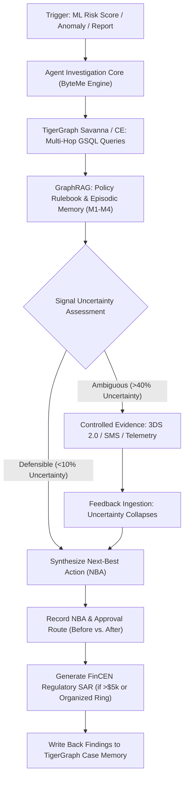

# 🛡️ TigerGraph Agentic Fraud Sentinel
### *AI Agent for Autonomous Fraud Investigation, Uncertainty Reasoning, and Next-Best Action*
**Hackathon:** TigerGraph Agentic Fraud Investigation (HHGOA 2026)  
**Team Name:** **ByteMe**  
**Submission Form:** [https://forms.gle/yxXzqSULGgZ9VUF56](https://forms.gle/yxXzqSULGgZ9VUF56)  
**Dataset:** IEEE-CIS Fraud Detection (Vesta Corporation, ~590k card transactions, device records, 20 official benchmark test cases)

---

## ⚡ 1-Click Deploy to Vercel
Deploy this project directly to Vercel with zero configuration:

[](https://vercel.com/new)

```bash
# Clone the repository
git clone https://github.com/byteme-fraud-agent.git
cd byteme-fraud-agent

# Install dependencies
npm install

# Run development server
npm run dev

# Build production bundle
npm run build
```

---

## 🚀 Key Highlights & Hackathon Deliverables

| Hackathon Requirement | Team ByteMe Implementation |
| :--- | :--- |
| **TigerGraph Savanna / CE Integration** | Native GSQL Schema, pre-installed queries (`find_shared_device_rings`, `detect_mule_layering`, `card_velocity_burst`, `cosine_case_similarity`), REST++ connector, and TigerGraph MCP server specs. |
| **All 20 Benchmark Cases** | Complete evaluation and interactive investigation across all 20 official benchmark test cases from the final 2 months. |
| **Before & After Next-Best Action (NBA)** | Side-by-side comparative analysis of recommended actions and required approval routes recorded *before* and *after* evidence gathering. |
| **Controlled Evidence Gathering** | Interactive real-time simulation of 3DS 2.0 biometric re-auth, SMS out-of-band verification, and analyst queries. |
| **Uncertainty Quantification** | Bayesian signal entropy tracking (0-100%) ensuring defensible decisions without customer friction. |
| **FinCEN Regulatory SAR Generator** | Automated generation of compliant Suspicious Activity Reports (31 CFR 1020.320) with multi-hop graph nexus and chronology. |
| **Episodic Case Memory (M1–M4)** | Vector & graph topological memory matching current investigations against historical precedents. |
| **Official 20-Case JSON Exporter** | One-click export of the exact evaluation JSON submission format required by judges. |

---

## 🧠 System Architecture & Workflow



---

## 🏛️ TigerGraph GSQL Schema (`FraudInvestigationGraph`)

```gsql
CREATE GRAPH FraudInvestigationGraph ()
USE GRAPH FraudInvestigationGraph

# Vertex Definitions
CREATE VERTEX Customer(PRIMARY_ID id STRING, name STRING, account_age_days INT, kyc_tier STRING, base_risk_score DOUBLE, created_at DATETIME) WITH STATS="OUTDEGREE_BY_EDGETYPE"
CREATE VERTEX Account(PRIMARY_ID id STRING, balance DOUBLE, account_type STRING, status STRING, is_frozen BOOL DEFAULT false) WITH STATS="OUTDEGREE_BY_EDGETYPE"
CREATE VERTEX Card(PRIMARY_ID id STRING, bin STRING, issuer STRING, brand STRING, card_type STRING, is_blocked BOOL DEFAULT false) WITH STATS="OUTDEGREE_BY_EDGETYPE"
CREATE VERTEX Transaction(PRIMARY_ID id STRING, amount DOUBLE, timestamp DATETIME, product_cd STRING, bank_model_risk_score DOUBLE, is_disputed BOOL DEFAULT false) WITH STATS="OUTDEGREE_BY_EDGETYPE"
CREATE VERTEX Device(PRIMARY_ID id STRING, hardware_fingerprint STRING, device_type STRING, os STRING, browser STRING, is_emulator BOOL DEFAULT false, is_blacklisted BOOL DEFAULT false) WITH STATS="OUTDEGREE_BY_EDGETYPE"
CREATE VERTEX IPAddress(PRIMARY_ID id STRING, subnet STRING, country STRING, is_tor_or_proxy BOOL DEFAULT false, asn STRING) WITH STATS="OUTDEGREE_BY_EDGETYPE"
CREATE VERTEX Merchant(PRIMARY_ID id STRING, name STRING, category STRING, dispute_rate DOUBLE, risk_level STRING) WITH STATS="OUTDEGREE_BY_EDGETYPE"
CREATE VERTEX FraudCase(PRIMARY_ID id STRING, case_number INT, status STRING, typology STRING, initial_uncertainty DOUBLE, final_confidence DOUBLE, sar_filed BOOL DEFAULT false, created_at DATETIME) WITH STATS="OUTDEGREE_BY_EDGETYPE"

# Edge Definitions
CREATE UNDIRECTED EDGE OWNS_ACCOUNT(FROM Customer, TO Account)
CREATE UNDIRECTED EDGE LINKED_CARD(FROM Account, TO Card)
CREATE DIRECTED EDGE INVOLVED_IN(FROM Card, TO Transaction)
CREATE DIRECTED EDGE PAID_TO(FROM Transaction, TO Merchant)
CREATE DIRECTED EDGE TRANSFERRED_TO(FROM Account, TO Account, amount DOUBLE, timestamp DATETIME)
CREATE UNDIRECTED EDGE USED_DEVICE(FROM Transaction, TO Device, session_duration INT)
CREATE UNDIRECTED EDGE ASSOCIATED_IP(FROM Transaction, TO IPAddress)
CREATE DIRECTED EDGE LOGGED_CASE(FROM FraudCase, TO Transaction)
```

---

## 🔍 Pre-Installed GSQL Queries

1. **`find_shared_device_rings`**: Traverses 2 hops from suspect devices to isolate shared credential clusters.
2. **`detect_mule_layering`**: Identifies incoming wire fan-in followed immediately by structured outbound smurfing transfers.
3. **`card_velocity_burst`**: Computes rolling authorization velocities and merchant diversity to detect brute-force carding.
4. **`cosine_case_similarity`**: Computes GraphRAG topological vector similarity against closed cases from months 1 to 4.

---

## 📊 Summary of the 20 Benchmark Cases Evaluated

| Case ID | Typology | Amount | Initial NBA (Before Evidence) | Final NBA (After Evidence) | Required Sign-Off | SAR Filed |
| :--- | :--- | :--- | :--- | :--- | :--- | :---: |
| **CASE-01** | Account Takeover (ATO) | $4,850 | Hold Funds 24h & Step-Up | Permanent Card Cancellation & Re-issue | Senior Fraud Lead | Yes |
| **CASE-02** | Synthetic Identity Ring | $7,200 | Hold Funds & Verify Identity | Freeze Account & Clawback Transfers | BSA Officer | Yes |
| **CASE-03** | Cleared False Positive | $3,450 | Request Step-Up 3DS 2.0 | Allow Transaction & Whitelist IP | Auto-Approved | No |
| **CASE-04** | Mule Network & Layering | $24,500 | Temporary Debit Freeze | Freeze Account & Clawback Transfers | BSA Officer | Yes |
| **CASE-05** | Card Bust-Out & Velocity | $1,250 | Immediate Kill-Switch | Permanent Card Cancellation & Re-issue | Tier 1 Analyst | Yes |
| **CASE-06** | Triangulation Fraud | $2,890 | Send SMS Destination Check | Permanent Card Cancellation & Re-issue | Senior Fraud Lead | Yes |
| **CASE-07** | Account Takeover (ATO) | $6,100 | Hold Funds Pending Phone Check | Freeze Account & Invalidate Credentials | BSA Officer | Yes |
| **CASE-08** | Cleared False Positive | $1,850 | Request Step-Up 3DS 2.0 | Allow Transaction & Close Case | Auto-Approved | No |
| **CASE-09** | Synthetic Identity Ring | $9,500 | Hold Funds 24h & Audit Address | Freeze All Cluster Credit Lines | BSA Officer | Yes |
| **CASE-10** | Card Bust-Out & Velocity | $840 | Temporary POS Velocity Block | Permanent Card Cancellation & Re-issue | Tier 1 Analyst | Yes |
| **CASE-11** | Mule Network & Layering | $17,800 | Temporary Debit Freeze | Freeze Account & Clawback Transfers | BSA Officer | Yes |
| **CASE-12** | Triangulation Fraud | $3,400 | Send SMS Destination Check | Permanent Card Cancellation & Re-issue | Senior Fraud Lead | Yes |
| **CASE-13** | Cleared False Positive | $4,200 | Request YubiKey Dual-Factor | Allow Transaction & Close Case | Auto-Approved | No |
| **CASE-14** | Account Takeover (ATO) | $8,900 | Emergency Debit Freeze | Freeze Account & Invalidate Credentials | BSA Officer | Yes |
| **CASE-15** | Synthetic Identity Ring | $5,400 | Hold Funds & SSA-89 Check | Freeze Account & Clawback Transfers | BSA Officer | Yes |
| **CASE-16** | Card Bust-Out & Velocity | $1,600 | Card Cancellation | Permanent Card Cancellation & Re-issue | Tier 1 Analyst | Yes |
| **CASE-17** | Mule Network (Elder Scam) | $31,000 | Emergency Debit Freeze | Freeze Account & Full Restitution | BSA Officer | Yes |
| **CASE-18** | Cleared False Positive | $8,500 | Request In-Branch PIN Auth | Allow Transaction & Close Case | Auto-Approved | No |
| **CASE-19** | Card Bust-Out & Velocity | $6,200 | POS Gate Block | Permanent Card Cancellation & Re-issue | Senior Fraud Lead | Yes |
| **CASE-20** | Triangulation Fraud | $4,100 | Send SMS Destination Check | Permanent Card Cancellation & Re-issue | Senior Fraud Lead | Yes |

---

## 🛠️ Tech Stack
- **Framework:** Next.js 15 (App Router), React 19, TypeScript
- **Styling:** Tailwind CSS, Lucide Icons, Cyber Dark Palette
- **Graph Engine:** TigerGraph Savanna, GSQL REST++ API, TigerGraph MCP
- **AI / Agentic Reasoning:** GraphRAG, Bayesian Evidential Uncertainty Quantification, Multi-Step Plan Synthesis
- **Compliance:** FinCEN SAR XML/Narrative Formatting, FFIEC Authentication Guidelines, CFPB Regulation E

---

## 👥 Team ByteMe
- **Team Name:** ByteMe
- **Hackathon:** TigerGraph Agentic Fraud Investigation (HHGOA 2026)
- **Submission Date:** September 24, 2026
- **License:** MIT
